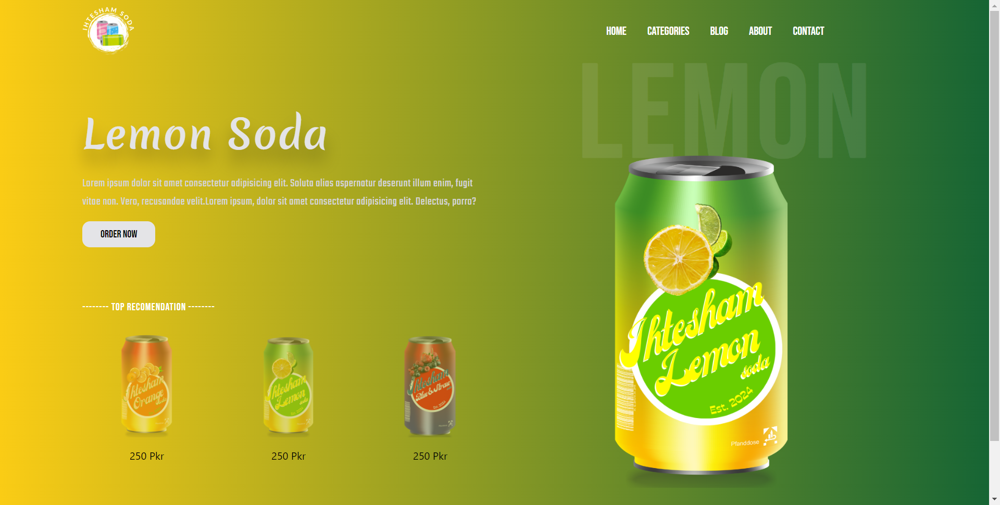

# Soda Beverage Cans Landing Page

Welcome to the repository for the **Soda Beverage Cans** landing page! This project showcases a sleek and modern landing page designed to feature a variety of soda can designs. The website is hosted on Vercel and built with cutting-edge web technologies including React, Vite, and GSAP animations.

[**Live Demo**](#) <!-- Replace `#` with your Vercel live link -->

---

## 📸 Screenshots

 <!-- Replace `./path-to-your-image.png` with the actual path to your screenshot -->

---

## 🚀 Features

- **Custom Tin Designs**: Unique soda can designs created using Canva.
- **Dynamic Soda Selection**: Interactive UI for selecting different soda flavors with corresponding background changes.
- **Responsive Design**: Fully responsive across all devices.
- **GSAP Animations**: Smooth and engaging animations powered by GSAP.
- **Vite Bundler**: Fast and optimized development environment with Vite.
- **React Components**: Modular and reusable components using React.
- **Context API**: Efficient state management using React's Context API.

---

## 🛠️ Technologies Used

- **React**: JavaScript library for building user interfaces.
- **Vite**: Next-generation front-end tooling and bundling.
- **GSAP**: Professional-grade animation library for the web.
- **Canva**: Used for designing the custom tin images.
- **Tailwind CSS**: Utility-first CSS framework for styling.
- **Vercel**: Hosting platform for the live demo.

---

## 📂 Project Structure

```
├── public
│   └── index.html
├── src
│   ├── assets
│   │   ├── logo.png
│   │   ├── orange.png
│   │   ├── lemon.png
│   │   └── straw.png
│   ├── components
│   │   ├── Navbar.jsx
│   │   ├── Background.jsx
│   │   └── Hero.jsx
│   ├── context
│   │   └── DrinksContext.jsx
│   ├── App.jsx
│   └── main.jsx
├── package.json
├── tailwind.config.js
└── vite.config.js
```

---

## 📦 Installation

1. Clone the repository:
   ```bash
   git clone https://github.com/your-username/soda-beverage-cans.git
   ```
2. Navigate to the project directory:
   ```bash
   cd soda-beverage-cans
   ```
3. Install dependencies:
   ```bash
   npm install
   ```
4. Start the development server:
   ```bash
   npm run dev
   ```

---

## 🖥️ Deployment

The site is deployed on Vercel. To deploy your own version:

1. Connect your repository to Vercel.
2. Configure the necessary environment settings.
3. Deploy with a single click!

---

## 📜 License

This project is licensed under the MIT License.

---
